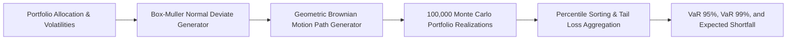

# FSHARP-RISK-SIMULATION-ENGINE
# Quantitative Risk Simulation & VaR Engine (F#)

## Executive Overview
A high-throughput quantitative risk engine written in **F# (.NET 8.0)**. It utilises functional programming paradigms (immutability, pattern matching, pure functions) to execute Monte Carlo multi-asset portfolio simulations, computing **95% & 99% Value-at-Risk (VaR)** and **Expected Shortfall (CVaR)**.

## Simulation Pipeline



### Source Tree
- **`src/RiskSimulation.fs`**: Pure functional Monte Carlo simulation logic.
- **`src/Program.fs`**: Executable console entrypoint.
- **`src/RiskSimulationEngine.fsproj`**: .NET 8.0 F# project manifest.
- **`runner/run.js`**: Verification harness validating quantitative risk figures.

## Mathematical Formulation: Geometric Brownian Motion
Asset price paths follow the stochastic differential equation:
$$S_t = S_0 \exp\left( \left(\mu - \frac{1}{2}\sigma^2\right)t + \sigma \sqrt{t} Z \right)$$

where $ Z \sim \mathcal{N}(0, 1) generated via the Box-Muller transform. Expected Shortfall (CVaR) at confidence level \alpha = 0.99:
$$CVaR_\alpha = -\frac{1}{1 - \alpha} \int_{0}^{1 - \alpha} \text{VaR}_u \, du$$

## Native .NET Execution
```bash
cd src
dotnet run
```

## Universal Verification
```bash
node runner/run.js
node orchestrator/run.js --project=18-fsharp
```

## Senior Interview Q&A
- **Q: Why F# for quantitative finance?** F# combines functional correctness (no null pointer exceptions, pattern matching) with high-performance native .NET JIT execution, SIMD vectorization, and easy parallelization (`Array.Parallel`).
- **Q: Why is CVaR preferred over VaR?** Value-at-Risk (VaR) only tells you the threshold loss at a given percentile; it does not measure the severity of tail losses beyond that threshold. Expected Shortfall (CVaR) is a coherent risk measure that averages all losses in the worst 1% tail.\n
